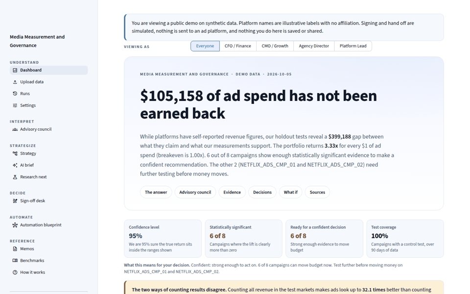
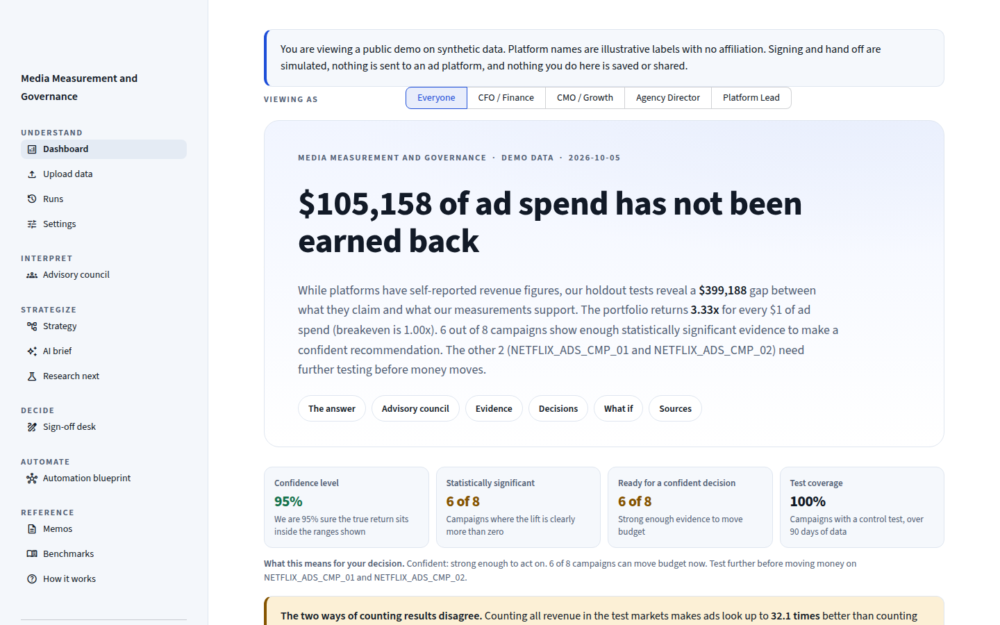
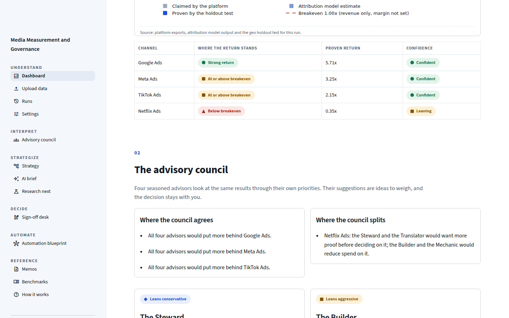
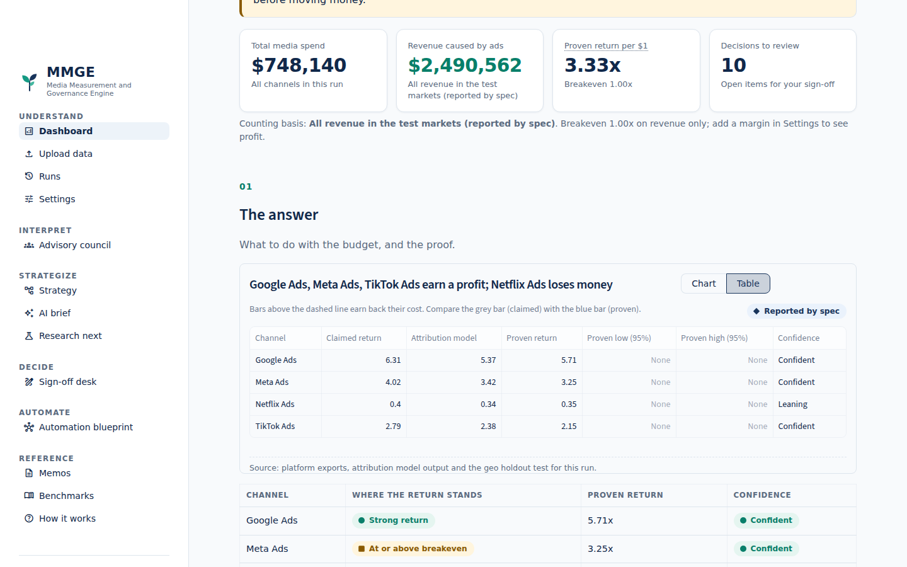
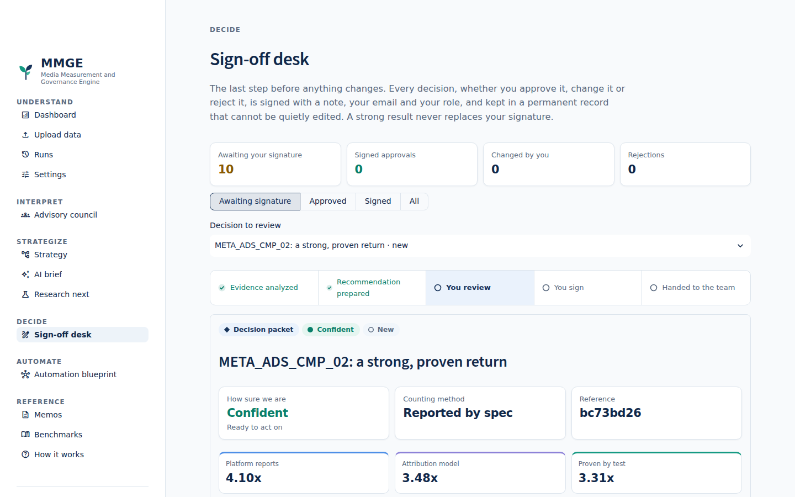
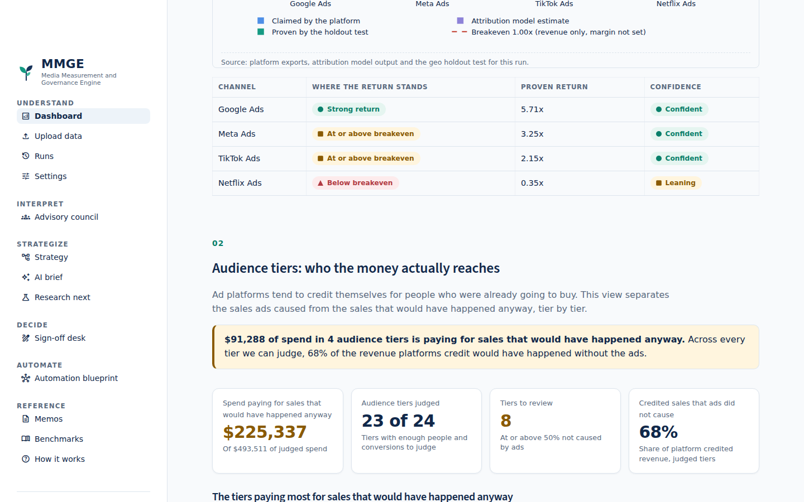
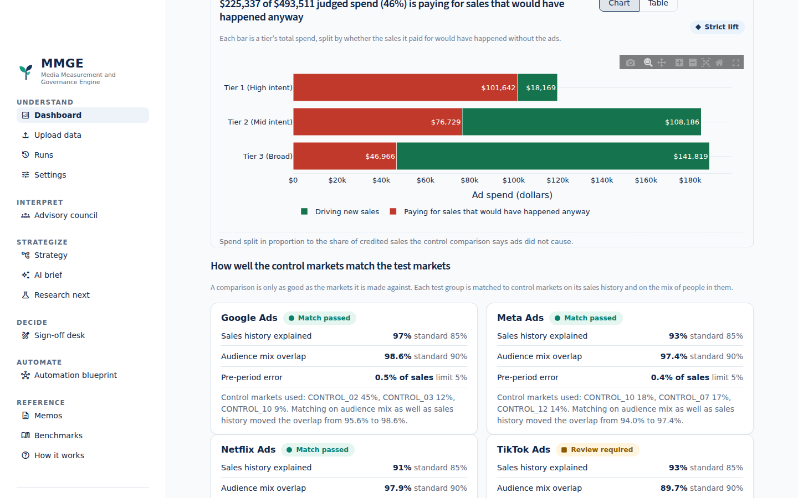
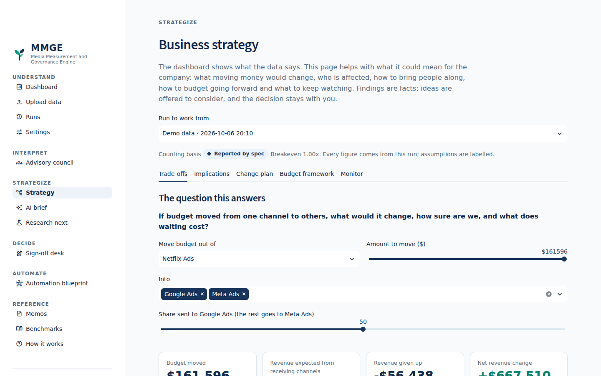
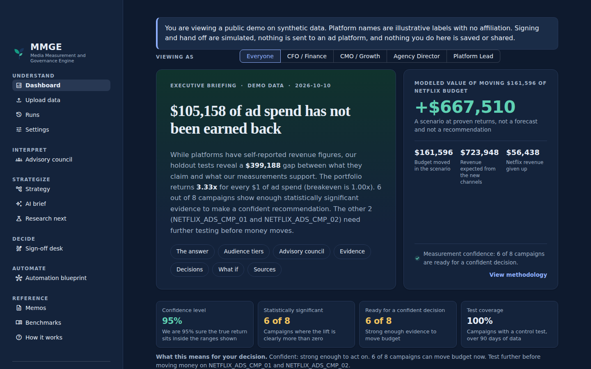

# Media Measurement and Governance Engine

**The system that enables a business leader to optimize tactics, strategy, and investments to maximize ROI and effective decision making in a dynamic business environment, using informed data insights, and human-in-the-loop AI-powered data governance, protections and effective informed business decision-making.**

[](https://github.com/jamsgithubuser1492/Data-Analytics-Governance-Engine-Case-Project/actions/workflows/ci.yml)


**[Open the live demo](https://james-moy-data-governance-engine-portfolio.streamlit.app/)** (no install, about 20 seconds to load) &nbsp;|&nbsp; **[Watch the 90 second walkthrough](docs/VIDEO_SCRIPT.md)** &nbsp;|&nbsp; **[Read the page by page guide](docs/PAGE_GUIDE.md)**



> **Please read first: what this is and is not**
> * **The data is synthetic.** It was generated so the case study is repeatable. Real company data is messier, and this project does not claim results on real data.
> * **Platform names are illustrative.** Google, Meta, TikTok and Netflix appear only as labels. There is no affiliation with, or endorsement by, any of those companies, and no real company data is used.
> * **Nothing here moves real money.** Signing and hand off are simulated. Nothing connects to an ad platform.
> * **This is a portfolio project,** not production software and not financial advice.

<sub>The visual design follows the written [MMGE design system](docs/DESIGN_SYSTEM.md): calm navy and green, evidence before recommendation, and a person always in control.</sub>

## The idea in one minute

Companies spend a lot on online advertising. The ad platforms (the "channels") report how much sales their own ads created, and those reports tend to be generous. A leader who trusts them may keep paying for ads that are not really working.

This project compares three views of the same spending:

1. **What the platforms say** they delivered.
2. **What an attribution model says**, which shares out credit for each sale across the ads a customer saw.
3. **What a controlled test proves.** Some cities keep seeing ads and similar cities do not. The difference shows what the ads actually caused.

It then explains the answer the way a colleague would, shows how sure it is, lets four "advisors" react from different business angles, and routes every decision to a person who signs it, with the signature kept in a record that cannot be quietly edited.

## What it found on the sample data

| | |
| --- | --- |
| Total ad spend | **$748,140** |
| Return per $1 spent, counting all revenue in the test cities (the simpler count) | **3.33x** |
| Ad spend not earned back (all of it in one channel) | **$105,158** |
| Revenue platforms claimed that the tests do not support | **$399,188** |
| Campaigns with strong enough evidence for a confident recommendation | **6 of 8** |
| The same portfolio counting only the extra revenue the ads caused | about **0.57x**, so spending does not pay back at that stricter count |
| Spend in the four most affected audience tiers paying for sales that would have happened anyway (synthetic audience example) | **$91,288** |

The two ways of counting disagree by up to 32 times on some campaigns. The dashboard says so openly and explains which count is safer for budget decisions.

## Try it

| You are | Do this |
| --- | --- |
| A reviewer in a hurry | Open the **live demo** above. It loads the sample data by itself. |
| Comfortable with Docker | `docker build -t mmge . && docker run -p 8501:8501 mmge` then open http://localhost:8501 |
| Comfortable with Python | `pip install -r requirements.txt` then `python -m streamlit run app/app.py` |
| Using GitHub Codespaces | Open the repository in a Codespace; it installs everything. Then run `python -m streamlit run app/app.py` |

Having trouble or seeing an old version? See [docs/GETTING_STARTED.md](docs/GETTING_STARTED.md).

## A look inside

| | |
| --- | --- |
|  **The answer first.** A plain headline, the gap between claims and proof, and how sure we are. |  **Four advisors** read the same results as a finance chief, a growth lead, an agency head and a measurement specialist. |
|  **Every chart has a table view** you can copy into a spreadsheet. |  **The sign-off desk.** Every decision is signed and recorded. |
|  **Audience tiers.** Which groups of people the money reaches, and how much of the spend is paying for sales that would have happened anyway. |  **A fair comparison.** Each group of control markets is checked against the test markets before its results are trusted. |
|  **Strategy.** What a budget move would change, best case and worst case. |  **Dark mode** and a phone friendly layout. |

Every page is explained in plain words in the [page by page guide](docs/PAGE_GUIDE.md).

## Case study

### The problem
A marketing leader reports to a finance chief who asks one question: "Did this spend earn its money back?" The ad platforms answer yes. The finance team's own numbers often say otherwise. Nobody in the room can tell which is right, so decisions turn into arguments, and the arguments are hard to explain to a board.

### My approach
I treated it as a product for busy executives, not a statistics tool.
1. **Start from the decision.** What would a chief financial officer, a chief marketing officer, an agency director and a media lead each want to know first? Each gets their own view.
2. **Show proof, not opinion.** Results come from a controlled test, shown with a 95% likely range and quality checks, and every number can be traced to its source.
3. **Keep people in charge.** The system suggests in cautious language ("Consider...") and never acts alone. Each decision is signed with a note, an email and a role.
4. **Protect the data and the company.** Personal data is blocked or removed, the AI assistant only ever sees summary totals, and the design for connecting AI tools gives the AI no power to approve or spend.
5. **Look below the average.** An overall return can hide that a platform is mostly reaching people who would have bought anyway. The audience tier view splits spend by how likely people were to buy without an ad, compares test and control markets, and shows how many dollars of each tier are paying for sales that would have happened anyway. It only judges tiers with enough data, and checks that the control markets are a fair match first.
6. **Write it so a non specialist understands it.** A written voice guide keeps jargon off the screen, and an automated test fails if building notes or jargon leak into the pages.

### The result
A working product with 13 pages, a verified sample dataset, an audience tier view that shows which groups of people the money reaches, and nearly 500 automated tests. On the sample data it shows that the platforms' claims and the controlled tests differ by hundreds of thousands of dollars, that most of the money not earned back sits in one channel, and which campaigns are strong enough to act on.

### Trade-offs I made, and why
* **Plain language over precision on screen.** Technical names move to a sources section. The cost is that experts must look one level deeper; the gain is that executives actually read it.
* **Two ways of counting, both shown.** The simple count looks better and the strict count is safer. I show both and explain the gap, rather than hiding the unflattering one.
* **Suggestions, not instructions.** The advisors say "Consider...". It is less punchy, but a tool that tells leaders what to do invites blind trust.
* **Simulated actions.** Nothing connects to a real ad platform. That keeps the demo safe, and the design document describes how a real connection would be made safely.
* **Synthetic data.** It makes results repeatable and avoids privacy issues, but it is cleaner than real life.

### What I would do differently next
* Test the engine on messy or public real world data and on simulated data with a known planted result, to show how often it finds the truth and how often it is fooled.
* Add real sign in and roles, a proper database, and a working (still approval only) AI connection.
* Run short sessions with real executives and record what confuses them.
* Build a board ready export (PDF and slides).

### What this project demonstrates
Turning a messy business question into a product, working with data and statistics responsibly, designing for non technical users, building in privacy, governance and auditability from the start, and directing AI tools to build and test a large system to a professional standard. See [docs/ROLE_FIT.md](docs/ROLE_FIT.md).

## How this was built

I acted as the product owner and orchestrator. I set the goals, made the decisions about what to include and what to leave out, reviewed each result, and insisted on quality rules (plain language, honest uncertainty, human sign off). Claude, an AI model, wrote the code under that direction, and an automated test suite checks the work. [docs/CHANGELOG.md](docs/CHANGELOG.md) shows the steps.

## Where to read more

| If you want | Read |
| --- | --- |
| Each page explained in plain words | [docs/PAGE_GUIDE.md](docs/PAGE_GUIDE.md) |
| How it looks and why (colour, type, components) | [docs/DESIGN_SYSTEM.md](docs/DESIGN_SYSTEM.md) |
| Which skills this shows, for which roles | [docs/ROLE_FIT.md](docs/ROLE_FIT.md) |
| Terms explained simply | [docs/GLOSSARY.md](docs/GLOSSARY.md) |
| How the numbers are produced | [docs/METHODOLOGY.md](docs/METHODOLOGY.md) |
| Privacy and governance | [docs/PRIVACY_AND_GOVERNANCE.md](docs/PRIVACY_AND_GOVERNANCE.md) |
| How AI tools could connect safely (design only) | [docs/ARCHITECTURE_MCP.md](docs/ARCHITECTURE_MCP.md) |
| How to put it online | [docs/DEPLOY.md](docs/DEPLOY.md) |
| Writing rules | [docs/VOICE_GUIDE.md](docs/VOICE_GUIDE.md) |
| What changed and what is next | [docs/CHANGELOG.md](docs/CHANGELOG.md), [docs/NEXT_PHASE.md](docs/NEXT_PHASE.md) |

Licence: all rights reserved, with permission to view and run the project for evaluation. See [LICENSE](LICENSE).

---

# Technical reference

The sections below are for engineers.

## Architecture

```
 data/generate_synthetic_data.py  (seed 42, 90 days, 4 channels x 2 campaigns)
            |
            v
 RAW LAYER        sql/01_raw_schema.sql           RAW_PLATFORM_DATA | RAW_MTA_OUTPUT | RAW_HOLDOUT_DATA | BUSINESS_BENCHMARKS
            |
 STAGING          sql/02_staging_transforms.sql   STG_UNIFIED_MEASUREMENT   (date, channel, campaign_id grain, holdout / 0.40)
            |
 ANALYTICS        sql/03_analytics_reconciliation.sql   ANALYTICS_MEASUREMENT_RECONCILIATION (reported_roas, incremental_roas, inflation_ratio)
            |
 GOVERNANCE       sql/04_governance_queries.sql   GOVERNANCE_CAMPAIGN_ALERTS | GOVERNANCE_AUDIT_SUMMARY
                  sql/05_rolling_performance.sql  ROLLING_7D_PERFORMANCE
            |
            +--> python/causal_impact_runner.py --> python/governance_checker.py (8 checks, trust score, JSON + markdown)
            +--> python/agent_orchestrator.py  --> app/app.py (Streamlit, persona filtered agent packets)
            +--> outputs/*.csv

 AUDIENCE LAYER (optional, aggregate only; data/audience/ or your own three files)
   AUDIENCE_DMA_PROPENSITY + AUDIENCE_DMA_SERIES --> python/propensity_scm.py  (control markets matched on sales history and audience mix; match quality)
   AUDIENCE_TIER_PERFORMANCE ---------------------> python/audience_tiers.py  (tier lift, 95% ranges, sample guard, spend paying for sales that would have happened anyway)
            |
            +--> AUDIENCE_TIER_RESULTS, AUDIENCE_MATCH_QUALITY --> guardrail packets (REDUCE_TIER_SPEND) --> Sign-off desk
```

## Repository layout

| Path | Purpose |
| --- | --- |
| `data/` | Generator plus the four verified raw CSVs (checksummed) |
| `data/audience/`, `data/generate_audience_data.py` | Synthetic audience layer (tier performance, market sales, audience mix) and its seeded generator; kept apart from the verified files |
| `sql/` | Five ANSI SQL pipeline files plus `audience_tier_views.sql` (staging tables and the tier view, Snowflake and DuckDB compatible) |
| `python/database_manager.py` | Builds the in-memory DuckDB warehouse and exports `outputs/` |
| `python/causal_impact_runner.py` | Synthetic control (OLS) estimate: point estimate, 95% CI, relative lift |
| `python/governance_checker.py`, `report_generator.py` | 8-point audit, JSON and markdown reports |
| `python/agent_orchestrator.py` | Three persona agents and simulated Snowflake action log |
| `python/propensity_scm.py` | Propensity weighted synthetic control: matches control markets on sales history and audience mix, with computed match quality |
| `python/audience_tiers.py` | Audience tier incrementality, sample guard, 95% ranges, aggregate data contract and match quality table |
| `python/signoff.py`, `overrides.py`, `run_store.py` | Signed decisions, the tamper evident log and the run store |
| `app/app.py` | Streamlit executive dashboard (pages in `app/pages/`) |
| `app/ui.py`, `charts.py` | The design system and chart builders (see `docs/DESIGN_SYSTEM.md`) |
| `scripts/make_screenshots.py` | Rebuilds the README screenshots and GIF from the demo |
| `tests/` | The automated test suite (about 500 tests) |

## Run it

The repository ships the **verified case study data** (the original files, checksummed in `data/VERIFIED_DATA.sha256`). You do not need to generate anything to use the app.

```bash
pip install -r requirements.txt
python -m streamlit run app/app.py         # opens http://localhost:8501 (use python -m if 'streamlit: command not found')
```

On the Dashboard choose **Try with demo data**. It runs on the verified files and the result is identical every time.

Optional checks and tools:

```bash
python python/verify_data.py               # confirms data/*.csv still match the verified originals
pytest                                     # the full test suite
python python/database_manager.py          # standalone SQL pipeline -> outputs/*.csv (reference outputs)
python python/governance_checker.py        # standalone causal impact + 8 point audit -> outputs/governance_audit_report.{json,md}
python data/generate_audience_data.py      # OPTIONAL: rebuilds the synthetic audience example in data/audience/ (same seed, same files)
python data/generate_synthetic_data.py     # OPTIONAL: new synthetic data in data/generated/ (never overwrites the verified files)
```

Synthetic data generation is also available inside the app (Upload data, then Generate new synthetic data). It loads the data in memory for experiments and never replaces the verified files. If a verified file is ever changed by accident, restore it with `git checkout -- data/`.

### Updating to the latest version

`pip install` only installs libraries. It never updates the code, and a running app keeps serving the old files. To update:

```bash
git status                       # if it lists files under outputs/ or data/, they are generated files you can set aside
git stash                        # (or: git checkout -- outputs data) clears local generated changes
git checkout main
git pull origin main
# stop the running app with Ctrl+C, then start it again
python -m streamlit run app/app.py
```

The sidebar shows a small "Version" line (commit and date) so you can confirm which code is running. The optional commands above that write to `outputs/` change tracked files, which is the usual reason a later `git pull` is refused.

## Snowflake setup

Run `sql/01_raw_schema.sql` in a worksheet. The commented block at its bottom creates the database, schema, CSV file format and internal stage, and lists the `COPY INTO` commands (upload `data/*.csv` to `@MMGE_RAW_STAGE` first). Then run `02` to `05` in order. Nothing in the SQL is DuckDB specific.

## Metrics

* `reported_roas = total_platform_revenue / total_spend`
* `incremental_roas (iROAS) = total_holdout_revenue / total_spend`
* `inflation_ratio = total_platform_conversions / total_holdout_conversions`
* Holdout treatment conversions and revenue are divided by 0.40 to correct for the 40% geo sample.

Governance status: `CRITICAL_INFLATION_WARNING` at ratio >= 3.0, `MODERATE_INFLATION` at 1.5 to <3.0, `NO_HOLDOUT_COVERAGE` when holdout data is missing, otherwise `PASS`.

Agents: `CAPITAL_PRESERVATION_AGENT` (reported ROAS >= 1.5 and iROAS < 1.0), `ATTRIBUTION_SHIELD_AGENT` (1.25 < inflation <= 3.0), `SCALE_OPPORTUNITY_AGENT` (iROAS >= 3.0 and inflation <= 1.25). Triggers are independent, so one campaign can fire more than one agent.

## Key findings (seed 42 data)

| Channel | Spend | Platform ROAS | MTA ROAS | iROAS | Action |
| --- | --- | --- | --- | --- | --- |
| Google Ads | $264.7k | 6.31x | 5.37x | 5.71x | Scale |
| Meta Ads | $207.97k | 4.02x | 3.42x | 3.25x | Scale |
| TikTok Ads | $113.85k | 2.79x | 2.38x | 2.15x | Monitor |
| Netflix Ads | $161.6k | 0.40x | 0.34x | 0.35x | Reduce |

* Portfolio: $748.1k spend, $2.89M platform revenue claimed, $2.49M holdout revenue, blended iROAS 3.33x.
* The causal runner recovers the planted 1.20x lift (about +20%) for Google, Meta and TikTok. Netflix volume is too small for a significant lift (interval includes zero), so the audit marks that result as not decision grade.
* Shifting all Netflix spend 50/50 into Google and Meta projects about **+$667.5k** net revenue (dashboard simulator default), assuming average iROAS holds at higher spend.
* Currently no campaign triggers the Capital Preservation agent: Netflix is unprofitable, but its platform ROAS (0.4x) is below the 1.5x "looks profitable" gate. It is flagged by the channel level `UNPROFITABLE` action and the audit instead.

## Trust foundations (Phase 0 of the product roadmap)

* `python/config.py`: validated `PolicySettings` (geo sample, thresholds, trust tiers, headline metric). Settings flow into SQL through the one row `POLICY_PARAMS` table, so the same SQL still runs on Snowflake.
* `python/schemas.py` and `python/validation.py`: data contract plus two tier validation (blockers stop a run, warnings are acknowledged). Covers missing columns, bad dates, negatives, duplicate keys, mixed currency, personal data columns, spend unit suspicion, date gaps, coverage gaps, short pre-period and low volume.
* Missing sources are now NULL (unknown), never 0, with per source coverage flags. Channel iROAS divides by the spend of campaigns that actually have holdout coverage.
* `DatabaseManager.build()` runs integrity assertions (row counts, grain uniqueness, spend preserved, no negatives) and raises `PipelineIntegrityError` on failure.
* `python/strict_lift.py`: strict lift iROAS (causal gap only, over test period spend) next to the spec view. The headline metric is a user policy choice and is stamped on every number.
* Trust tiers (Verified, Directional, Not decision grade) gate the money agents: cut and scale packets never fire on results that are not decision grade.

### Spec view vs strict lift (seed 42 data)

| Channel | Reported by spec iROAS | Strict lift iROAS |
| --- | --- | --- |
| Google Ads | 5.71x | about 1.00x (95% CI roughly 0.78 to 1.21) |
| Meta Ads | 3.25x | about 0.57x |
| TikTok Ads | 2.15x | about 0.38x |
| Netflix Ads | 0.35x | about 0.02x (not statistically distinguishable from zero) |

The planted lift is 1.20x, so only about one sixth of treatment geo revenue is truly incremental. Under strict lift no channel clears breakeven on revenue, which changes the budget story: the +$667.5k reallocation figure holds only under the spec view (about +$124k under strict lift).

## Runs, onboarding and the multipage app (Phases 1 and 2)

The dashboard is now a product loop: **Upload, Map, Check, Run, Decide, Act.**

| Page | What it does |
| --- | --- |
| Dashboard (`app/app.py`) | Plain English briefing, KPIs, trust gated agent packets with approve then execute, charts, scenario simulator, all read from a stored run |
| Upload (`app/pages/1_Upload.py`) | Templates, CSV or Excel upload, column mapping with confidence scores, totals row detection, validation report, preview, acknowledge warnings, run |
| Runs (`app/pages/2_Runs.py`) | Run history, compare two runs, agent inbox, audit log, safe CSV and JSON export |
| Settings (`app/pages/3_Settings.py`) | Data declarations (currency, timezone, spend unit, decimal and date format, channel aliases) and measurement policy, saved as versions |

Backend modules: `python/pipeline.py` (`run_pipeline`), `python/run_store.py` (SQLite WAL metadata plus Parquet artifacts, atomic commits, idempotent run keys, workspace scoping, inbox lifecycle, audit log), `python/job_runner.py` (background runs with a concurrency limit), `python/mapping.py` (file reading, mapping suggestions, number and date standardization) and `python/run_compare.py`.

Run data is stored under `var/` (set `MMGE_DATA_DIR` to change it). `PostgresRunStore` is the same code on Postgres but has **not** been exercised against a live database; real object storage, a login provider (Streamlit `st.login`) and Slack or email delivery are deployment steps still to do.

## Agent builder and fact checked memos (Phase 4)

**Agents are data, not code** (`app/pages/4_Agents.py`). A definition has a trigger (conditions on whitelisted metrics), persona, severity, an allowed action, a minimum trust tier, a spend floor, an optional deadband, value-add formulas and a message template. Formulas run in `python/safe_expr.py`, an AST allowlist evaluator (numbers, known field names, arithmetic, `min max abs round div`; no attribute access, imports or other calls). The three original agents ship as presets (`python/agent_presets.py`) and are proven identical to the old hardcoded orchestrator at every boundary, in both headline views. Money actions (cut or scale budget) can never fire below the Directional tier. Opposing money actions on the same campaign are resolved by priority. Each save is a new version, stored per workspace and stamped on every packet and run. The builder previews a rule on a real run and shows a plus or minus 10 percent sensitivity table that flags cliff edge campaigns.

**Memos can only contain numbers the code produced** (`app/pages/5_Memos.py`). Every number a memo may use is a numbered fact (`python/memo_facts.py`). The verifier (`python/memo_verify.py`) rejects any number that does not match, within its displayed precision and unit, a fact cited in the same sentence, plus uncited numbers, missing citations, links, code, markup and instruction-like text. Writers: a deterministic template writer, and a Claude writer (`python/memo_writer.py`) that is only enabled when `ANTHROPIC_API_KEY` is set (model from `MMGE_MEMO_MODEL`, default `claude-opus-5-5`; no tools, no sampling parameters). An AI draft gets one retry with the verifier's feedback, then falls back to the template; refusals, API errors and the daily cap (50 per workspace) also fall back. A memo moves draft, approved, exported; export needs a human approval, edits are re-verified, and every step is in the audit log. Set `MMGE_MEMO_WRITER=template` to disable AI drafting.

Not yet exercised: the live Claude call (tests use a fake client with the same interface).

## Benchmark registry (verified, with provenance)

`benchmarks/` holds `values.csv` (234 records), `sources.csv`, `evidence.json`, `excluded_claims.csv` and `snapshots/` of the primary files. Run `python python/benchmark_sync.py sync` to rebuild from the live sources, `python python/benchmark_verify.py` to re-verify offline (23 checks) and `python python/benchmark_verify.py --live` to re-download and compare (52 checks). `MMGE_LIVE=1 pytest` includes the live check.

**How reliability is enforced (not just documented):**
1. *Official data is parsed from the publisher's file and reconciled.* Damodaran margins (Jan 2026): gross margin equals 1 minus COGS/sales in all 96 industries. Census Vintage 2025: 50 states plus DC equal the US total (341,784,857), and 3,144 county rows equal it again. Census e-commerce share (17.1%, Q2 2026) equals the FRED series. Retail seasonality is the ratio of two Census series (RSXFSN over RSXFS), 12 months by 5 years.
2. *Study claims are admitted one by one.* Each has a verbatim quote extracted from the fetched primary page, and its numbers must appear in that quote; otherwise it is rejected. Every record carries its definition, attribution window, sample size and a confidence grade.
3. *Offline verification re-derives every official value from the stored snapshots* and re-checks every study claim against its spec, so hand edited values, tampered snapshots and hand added records fail (tested). Live verification re-fetches sources; changed files are reported as DRIFT (a new vintage), vanished quotes as FAIL.
4. *Comparability rules decide what a benchmark may be compared with.* For example, Littledata's median conversion rate is a site-wide session rate, so it is offered for order value (as a proxy) but explicitly refused for paid-ad click conversion. Channel ROAS, CPM and absolute incrementality factors have no verified primary source and are answered with "not comparable".
5. *Refused claims are logged with reasons* (`excluded_claims.csv`), including claims that checking the primary pages showed to be wrong or unsupported.

**Things checking the primary pages corrected:** Littledata's own page covers 421 stores (Sept 2026), not the 2,800 quoted by third-party blogs; the Damodaran file has no Retail (Online) row; a paper's abstract says observational methods "often fail to reproduce" experimental effects, not that they overestimate; Haus's publication date was not on the fetched page, so it is recorded as unknown; the Census population API needs a key, while bulk files do not and already hold Vintage 2025.

**What it feeds:** profit aware breakeven (`1 / margin`) from a declared margin or a labeled industry proxy (an upper bound on contribution margin); the geo sample fraction check (treatment geo FIPS codes against Census population, tolerance 15%); an optional seasonality adjustment of the control drift check; and a registry version stamped on any run that used it. The demo's four row `BUSINESS_BENCHMARKS` ranges are unsourced placeholders from the spec, so audit check 4 now reports "not applicable" for them instead of scoring against them.

**Limits:** vendor figures are marketing content (short attributed quotes only, medium confidence at most); Tier B sample sizes are small in places (33 stores); the margin proxies are public company aggregates, not DTC brands; seasonality is macro retail, not your category; Haus lift is a lift on a KPI, not an iROAS.

## Caveats

* The synthetic data is deliberately clean: control equals treatment before launch (zero pre-period variance) and the lift is exactly 1.20x. The causal runner applies a Poisson noise floor so intervals stay honest.
* Per the project spec, iROAS uses total treatment geo revenue scaled by 1/0.40. A stricter incrementality view would use only the lift over the counterfactual (treatment minus synthetic control), which is far smaller. `causal_impact_runner.py` produces that estimate.
* The Sign-off desk's hand off step simulates a Snowflake governance queue write (it records the approved change plus the INSERT it would run); nothing is sent to an ad platform.

## Executive dashboard design

The app is written for business leaders, not analysts. Design system in `app/ui.py`, chart logic in `app/charts.py`, calculations in `app/dashdata.py` (unit tested), shared wording in `python/voice.py`, the signed decision log in `python/overrides.py` and `python/signoff.py`. The writing rules are in `docs/VOICE_GUIDE.md`.

* **Answer first.** The home page opens with a plain headline of the main finding (for example "$105,158 of ad spend has not been earned back") and a short summary: the gap between what platforms claim and what the tests support, the portfolio return per $1, and how many campaigns have strong enough evidence for a confident recommendation.
* **A confidence strip** under the headline shows the confidence level (95%), how many campaigns are statistically significant, how many are ready for a confident decision, and test coverage, with a line on what that means for the decision.
* **Five perspectives** (Everyone, CFO / Finance, CMO / Growth, Agency Director, Platform Lead) change the landing view and wording.
* **Advisory council.** Four seasoned advisors (the Steward, the Builder, the Translator, the Mechanic) read the same results through their own priorities and speak in budget, growth, client and measurement terms. Stances: Put more behind it, Keep as is, Test again before deciding, Reduce spend, Prove it before deciding. Suggestions are always tentative.
* **Two ways of counting are explained, not hidden.** When counting all test market revenue and counting only the revenue the ads caused disagree by more than 15%, the dashboard says so in plain words and says which is safer.
* **Uncertainty is shown.** The caused revenue count carries a 95% likely range; the other does not. Quality checks and sources are in the last section.
* **Every chart** states its finding and has a Chart or Table toggle. No dual axes. Axes are sized to the data, breakeven and thresholds.
* **Plain labels with an always-on glossary.** No emojis: status uses a distinct shape plus a text label. Light and dark themes follow the system or the Streamlit menu.
* **Audience tiers.** A section that shows which groups of people the money reaches, how much of each tier's spend is paying for sales that would have happened anyway, and whether the comparison markets are a fair match. It uses aggregate counts only.
* **Honest benchmarks.** No channel return band is drawn because no verified comparable one exists; see the Benchmarks page.
* **Decisions are signed.** Decision cards lead to the Sign-off desk, where every decision is signed and recorded in a tamper evident log.

## Strategy and AI brief

* **Strategy** (`app/pages/9_Strategy.py`): trade-offs with a best and worst case and a break-even sensitivity, a modeled value of waiting, an implications worksheet for five functions (estimates left blank for you), a fact-triggered change plan, an optional tiered budget lens, and a monitor.
* **AI brief** (`app/pages/10_AI_Brief.py`): a copy ready prompt of numbered, fact-grounded statements for your company's own AI assistant, with personal data redaction, optional name aliases and an answer checker.
* Governance and privacy: `docs/PRIVACY_AND_GOVERNANCE.md`. Writing rules: `docs/VOICE_GUIDE.md`. Setup help: `docs/GETTING_STARTED.md`. History: `docs/CHANGELOG.md`. What comes next (research engine, sign-off desk, automation blueprint): `docs/NEXT_PHASE.md`.

## Research, sign-off and automation

* **Research next** (`app/pages/11_Research.py`): ranked tests to consider with designs computed from the run, a synthetic control matcher and a media mix model prior calculator.
* **Sign-off desk** (`app/pages/12_Signoff.py`): every decision (approve, override or reject) is signed with a note, email, role and four acknowledgements, written to a hash chained `run_audit_log.json`. The store refuses to approve, execute or dismiss an item without a signature, and a result that is not decision grade cannot be approved.
* **Automation blueprint** (`app/pages/13_Automation.py`, `docs/ARCHITECTURE_MCP.md`): the design for connecting AI models through MCP. A design only, with no server. There is no approve or execute tool, and a model cannot supply its own trust score.
