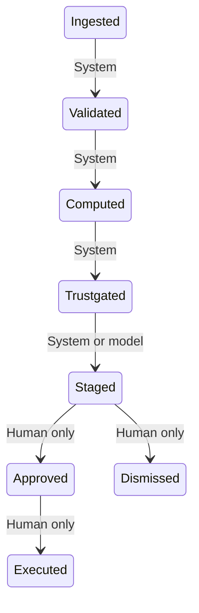

# Automation blueprint: connecting AI models to the engine safely

The engine can run continuously and let AI models read verified facts, test ideas and queue proposals, while a named person still signs every decision. This page is the design. The model never approves, never executes and never supplies its own trust score. Nothing described as Designed or Future exists yet.

## Status key

* **Built**: Code exists in this repository and is tested.
* **Designed**: Specified here; no code yet.
* **Future**: Depends on your organization's choices (credentials, vendors, sign-in).

## 1. The layers

| Layer | Component | Status | What it does |
| --- | --- | --- | --- |
| Data in | File upload and validation | Built | Accepts CSV or Excel, maps columns, blocks personal data columns, checks dates, duplicates and coverage. |
| Data in | Scheduled warehouse pulls | Designed | Pulls new aggregate data on a schedule from the company warehouse or platform exports. |
| Measure | Measurement engine | Built | Reconciles platform, attribution and holdout results; strict lift and spec bases; trust scores and levels. |
| Measure | Run store and audit trail | Built | Immutable runs, versioned policy, a signed decisions log that reveals edits. |
| Think | Guardrails and advisory council | Built | Rules flag results; four personas interpret them in tentative language. |
| Think | Research engine | Built | Ranks tests worth considering with designs computed from the run. |
| Connect | MCP server | Designed | Exposes six narrow tools, read only plus one staging tool, over a standard protocol. |
| Connect | Agent orchestration | Designed | A model calls the tools on a schedule or on request and prepares proposals for people. |
| Connect | Scheduler and notifications | Designed | Triggers runs, then tells the right person that something awaits their signature. |
| Decide | Sign-off desk | Built | Every decision is signed with a note, email, role and checklist; the store refuses unsigned changes. |
| Act | Execution connectors | Future | Applies a signed change in an ad platform through a scoped service account inside a change window. |
| Learn | Monitor and feedback | Built | Watches whether returns hold after a change and suggests retests. |

```text
  Company data and platform exports
            |
            v
  [ Ingestion and validation ]  -->  [ Measurement engine ]  -->  [ Guardrails, council, research ]
                                                                    |
                                                                    v
                 [ MCP server: six narrow tools ]  <--- reads facts, simulates, recommends
                                |  stage only
                                v
                 [ Sign-off desk: a named person signs ]  --->  [ Signed log, hash chained ]
                                |  signed approval only
                                v
                 [ Execution connector (future, scoped, change windows) ]
```

## 2. The six tools

There is deliberately no approve tool and no execute tool. No tool accepts a trust score, evidence level, counting basis or outcome from the caller; the server derives them from the stored run.

### get_verified_run_facts (Read)

Returns the numbered facts for a run: spend, proven return, trust, evidence level, interval where one exists.

Backed by: `app/prompt_pack.py build_facts`

It cannot:

* Return raw rows
* Return personal data
* Accept a trust score or evidence level from the caller

```json
{
  "type": "object",
  "properties": {
    "run_id": {
      "type": "string"
    },
    "counting_basis": {
      "type": "string",
      "enum": [
        "strict_lift",
        "reported_by_spec"
      ],
      "description": "Which view to read. Both are always computed."
    },
    "level": {
      "type": "string",
      "enum": [
        "portfolio",
        "channel",
        "campaign"
      ],
      "default": "channel"
    },
    "use_aliases": {
      "type": "boolean",
      "default": false
    }
  },
  "required": [
    "run_id"
  ],
  "additionalProperties": false
}
```

### evaluate_governance_rules (Read)

Runs the saved guardrails against a run and returns what they flag, with the evidence.

Backed by: `python/agent_engine.py evaluate_agents`

It cannot:

* Change thresholds (they come from the saved, versioned policy)
* Create or edit rules

```json
{
  "type": "object",
  "properties": {
    "run_id": {
      "type": "string"
    }
  },
  "required": [
    "run_id"
  ],
  "additionalProperties": false
}
```

### simulate_reallocation (Read)

Models moving budget between channels at proven returns, with a best and worst case where an interval exists.

Backed by: `app/strategy.py plan_reallocation`

It cannot:

* Change any budget
* Move more than a channel spends

```json
{
  "type": "object",
  "properties": {
    "run_id": {
      "type": "string"
    },
    "moves": {
      "type": "array",
      "items": {
        "type": "object",
        "properties": {
          "source": {
            "type": "string"
          },
          "target": {
            "type": "string"
          },
          "amount": {
            "type": "number",
            "minimum": 0
          }
        },
        "required": [
          "source",
          "target",
          "amount"
        ],
        "additionalProperties": false
      },
      "maxItems": 10
    },
    "return_haircut": {
      "type": "number",
      "minimum": 0,
      "maximum": 0.5,
      "default": 0
    }
  },
  "required": [
    "run_id",
    "moves"
  ],
  "additionalProperties": false
}
```

### recommend_experiments (Read)

Returns ranked research ideas with designs computed from the run.

Backed by: `app/research_engine.py build_specs`

It cannot:

* Start a test
* Spend anything

```json
{
  "type": "object",
  "properties": {
    "run_id": {
      "type": "string"
    },
    "channel": {
      "type": "string"
    }
  },
  "required": [
    "run_id"
  ],
  "additionalProperties": false
}
```

### stage_decision_packet (Stage only)

Puts a budget scenario or a research idea in the sign-off queue as an open item. It does nothing until a person signs it.

Backed by: `python/run_store.py add_inbox_item`

It cannot:

* Approve, reject or execute anything
* Set the trust score, evidence level, counting basis or outcome (the server derives them from the stored run)
* Stage a budget scenario whose evidence is not decision grade

```json
{
  "type": "object",
  "properties": {
    "run_id": {
      "type": "string"
    },
    "packet_type": {
      "type": "string",
      "enum": [
        "budget_scenario",
        "research_spec"
      ]
    },
    "moves": {
      "type": "array",
      "items": {
        "type": "object",
        "properties": {
          "source": {
            "type": "string"
          },
          "target": {
            "type": "string"
          },
          "amount": {
            "type": "number",
            "minimum": 0
          }
        },
        "required": [
          "source",
          "target",
          "amount"
        ],
        "additionalProperties": false
      },
      "maxItems": 10
    },
    "spec_id": {
      "type": "string"
    },
    "rationale": {
      "type": "string",
      "maxLength": 500
    }
  },
  "required": [
    "run_id",
    "packet_type"
  ],
  "additionalProperties": false
}
```

### get_audit_status (Read)

Reports whether the signed decisions log is intact and how many items await a signature, as counts only.

Backed by: `python/overrides.py verify_log`

It cannot:

* Return names or emails of signers
* Write to the log

```json
{
  "type": "object",
  "properties": {
    "run_id": {
      "type": "string"
    }
  },
  "required": [],
  "additionalProperties": false
}
```

Resources: methodology (the how it works guide); glossary of terms and formulas; run summaries (aggregate only).

Prompts: executive_brief: the AI brief prompt for a chosen audience and task, built by the same fact numbering as the app.

## 3. The decision state machine



| From | To | Who | What it means |
| --- | --- | --- | --- |
| Ingested | Validated | System | Data passes the onboarding checks, or is stopped with a plain explanation. |
| Validated | Computed | System | A run is created: measurement, trust scores, guardrails, research ideas. |
| Computed | Trust gated | System | Each result gets an evidence level that decides what may be proposed. |
| Trust gated | Staged | System or model | A proposal is queued as an open item. Not decision grade results cannot be staged as budget moves. |
| Staged | Approved | Human only | A named person signs with a note, email, role and checklist. |
| Staged | Dismissed | Human only | A person signs an override or a rejection. A newer run can also replace an open item. |
| Approved | Executed | Human only | A dry run today; an outside connector later, after the signed approval. |

Never allowed:

* Staged to Executed without Approved
* Any model or system actor reaching Approved, Dismissed by decision or Executed
* Approving a result that is not decision grade
* Signing the same item twice
* Editing or deleting a signed entry without the log showing it

## 4. Safety rules

| Rule | How it is enforced | Status |
| --- | --- | --- |
| There is no approve tool and no execute tool. | Design of the tool catalog; a test asserts no tool name contains approve or execute. | Designed |
| The model cannot supply trust, evidence level, counting basis or outcome. | Tool schemas have no such parameters; the server reads them from the stored run. | Designed |
| No decision takes effect without a signed entry. | The store refuses approved, executed and dismissed without a signature, and the log is hash chained. | Built |
| Results that are not decision grade cannot be approved. | Checked in the sign-off logic and shown on the desk. | Built |
| Aggregate data only; personal data never leaves. | Schema blocks personal columns; free text is scanned and redacted; aliases hide names. | Built |
| Read only by default, scoped to one workspace. | Per workspace credentials and an allowlist of tools; staging is a separate scope. | Designed |
| Every tool call is logged by content hash. | Same pattern as prompt exports; text is never stored. | Designed |
| Limits and a kill switch. | Rate and size limits per call; staging can be switched off per workspace at any time. | Designed |
| Signatures come from verified people in production. | Single sign-on provides the email and role; today the email is self asserted and recorded as such. | Future |
| Ad platform credentials never sit in the model layer. | Execution runs in a separate service with a scoped account and change windows. | Future |

## 5. The always on pipeline

| Step | What happens | By | How often | Status |
| --- | --- | --- | --- | --- |
| Pull | Scheduled job fetches new aggregate data and stores it with a content hash. | Scheduler | Daily or weekly | Designed |
| Validate | Onboarding checks run; blockers stop the pipeline and notify the data owner. | Engine | Each pull | Built |
| Measure | A run is created with both counting bases, trust scores and intervals. | Engine | Each valid pull | Built |
| Flag | Guardrails flag results; the research engine ranks questions. | Engine | Each run | Built |
| Prepare | A model reads facts through the tools and drafts a proposal or a research idea. | Model through MCP | Each run | Designed |
| Stage | The proposal is queued as an open item with its evidence. | Model or system | As needed | Designed |
| Notify | The right executive is told that something awaits a signature. | Notifier | On staging | Designed |
| Decide | A named person signs: approve, override or reject. | Human | On their schedule | Built |
| Act | A signed approval is handed to the team or an execution connector inside a change window. | Human, then connector | After signing | Future |
| Learn | The monitor checks whether the return held and suggests retests. | Engine | Weekly | Built |

## 6. When things go wrong

| Failure | Effect | Safe behavior |
| --- | --- | --- |
| Data fails validation | No run is created. | Stop, tell the data owner what to fix. Nothing is staged. |
| Run succeeds but evidence is weak | Results are Directional or not decision grade. | Advisory only, or blocked from budget proposals; research ideas are offered instead. |
| Model is unavailable or returns nonsense | No proposals are prepared. | Pipeline still produces runs and guardrail flags; people use the dashboard as today. |
| Model proposes something outside its tools | The call is rejected. | Schema validation fails the call; the attempt is logged. |
| Notification is missed | An item waits. | Items stay open and visible on the sign-off desk and are re-surfaced; nothing happens by default. |
| Signed log is edited | Chain verification fails. | The desk shows 'Log altered' and decisions are paused until investigated. |
| Execution connector fails | A signed change is not applied. | The item stays approved, not executed, and the failure is logged for a person to retry. |

## 7. Where it could run

* **Local, single user.** The MCP server runs on the same machine over standard input and output. Good for trying tools with a desktop assistant. No network exposure.
* **Company hosted.** The server runs behind the company gateway over HTTP with single sign-on, per workspace scopes, rate limits and logging. Recommended for shared use.
* **Warehouse integrated.** Scheduled pulls land aggregate data in the run store; the server reads only from the run store, never from the warehouse directly.

## 8. Rollout

| Phase | Delivers | Exit test |
| --- | --- | --- |
| 0. Today | Measurement, guardrails, council, strategy, AI brief, research ideas, sign-off desk with a tamper evident log. | Already in place. |
| 1. Read only tools | MCP server with four read tools and the audit status tool over local standard input and output. | Tool schemas validated; a test proves no tool can change anything. |
| 2. Staging | The stage tool plus notifications to the signer; company hosted with sign-in and scopes. | Staged items appear on the desk; verified identity recorded on every signature. |
| 3. Always on | Scheduled pulls, automatic runs, model prepared proposals each cycle. | Failure handling exercised; weekly review of staged versus signed items. |
| 4. Execution connectors | Scoped service accounts that apply signed changes inside change windows, one platform at a time. | Dry run parity, rollback tested, finance approval of the process. |

## 9. Privacy

Only aggregate marketing measurements move through the tools. Free text is scanned for personal data, names can be replaced with aliases, calls are logged by content hash only, and signer identities are never returned by a tool. See `docs/PRIVACY_AND_GOVERNANCE.md`. This is a design, not legal advice.

